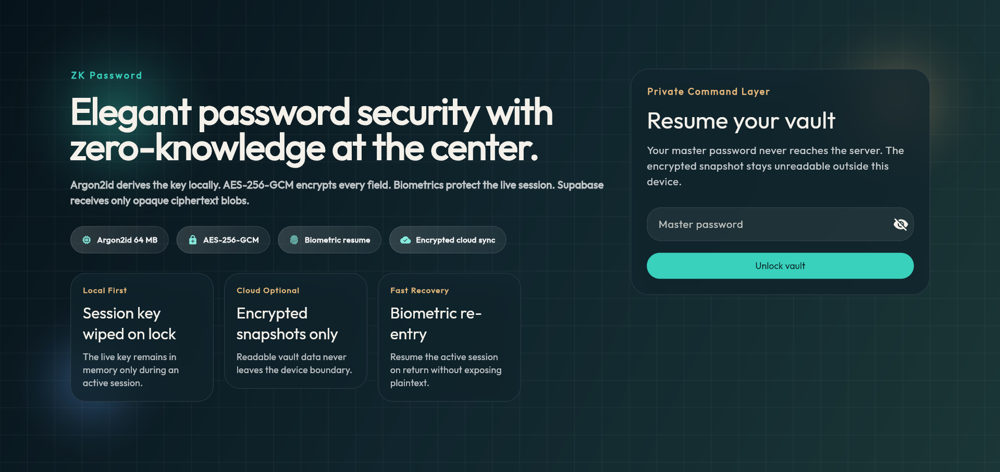
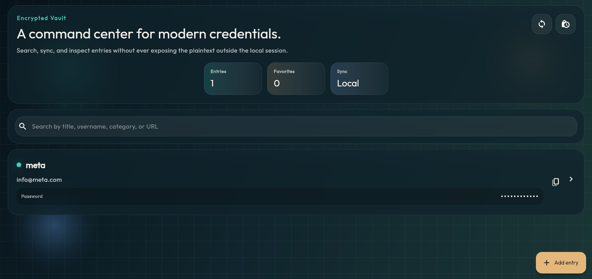
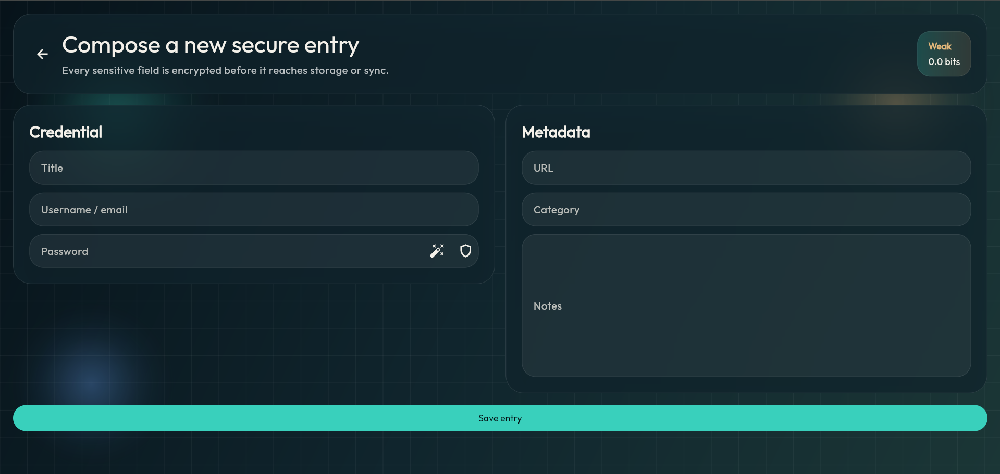
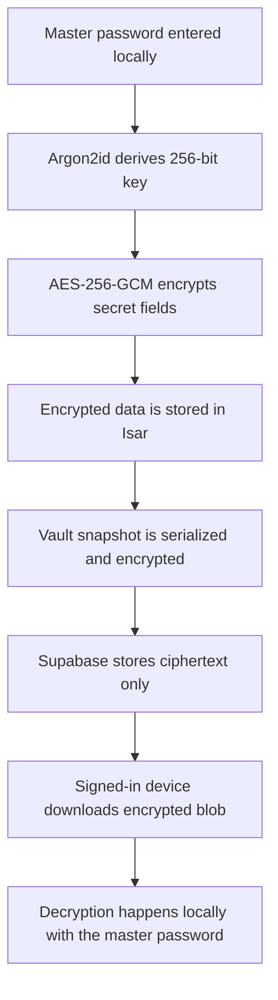

# Zero Vault

Zero Vault is a zero-knowledge password manager built with Flutter. Master-password processing and encryption happen locally on the device, while Supabase stores encrypted vault snapshots without access to plaintext data.

Designed as a modern security-focused application, Zero Vault combines a polished cross-platform interface with local-first storage, biometric session protection, and optional encrypted sync.

## Highlights

- Zero-knowledge architecture with local-only master-password handling
- Argon2id key derivation and AES-256-GCM authenticated encryption
- Local-first encrypted vault backed by Isar
- Optional Supabase sync for encrypted vault snapshots
- Biometric re-authentication and auto-lock session flow
- Clipboard auto-clear after 30 seconds
- Breach checking via the Have I Been Pwned k-anonymity API
- Unit-tested crypto, unlock, sync, and state-management flows

## Screenshots

| Unlock | Vault | Entry Detail |
| --- | --- | --- |
|  |  |  |

## Zero-Knowledge Flow



## Security Model

| Area | Decision | Rationale |
| --- | --- | --- |
| Key derivation | Argon2id | Memory-hard derivation designed for password-based secrets |
| Encryption | AES-256-GCM | Authenticated encryption with integrity protection and random nonces |
| Master password | Local-only handling | The backend never receives the master password |
| Cloud sync | Encrypted blob upload | Supabase stores ciphertext, not vault plaintext |
| Local secret metadata | `FlutterSecureStorage` | Secure device-backed storage for verifier and vault metadata |
| iOS keychain accessibility | `first_unlock_this_device` | Secure persistence with practical device usability |
| Session hardening | Auto-lock and biometric re-auth | Reduces exposure when returning from background |
| Clipboard handling | Timed auto-clear | Limits accidental password persistence outside the app |

## Feature Set

- Create and unlock an encrypted local vault
- Add, edit, search, and delete vault entries
- Generate strong passwords with adjustable entropy
- Check candidate passwords against known breach data
- Lock the vault and clear in-memory key material on session end
- Resume with biometric re-authentication
- Sign in with Supabase and sync encrypted snapshots across devices

## Architecture

Zero Vault follows a clean architecture structure that separates cryptography, data persistence, domain logic, and presentation concerns.

```text
lib/
  core/
    auth/
    config/
    crypto/
    utils/
  data/
    auth/
    local/
    models/
    repositories/
    sync/
  domain/
    entities/
    usecases/
  presentation/
    pages/
    providers/
    widgets/
test/
supabase/
env/
```

## Stack

- Flutter
- Dart
- Riverpod
- Go Router
- Isar
- Supabase
- flutter_secure_storage
- local_auth
- cryptography
- Argon2

## Key Implementation Files

- `lib/core/crypto/crypto_service.dart`
- `lib/core/auth/auth_service.dart`
- `lib/data/models/vault_entry.dart`
- `lib/data/repositories/vault_repo_impl.dart`
- `lib/data/sync/sync_service.dart`
- `lib/domain/usecases/unlock_vault.dart`
- `lib/presentation/providers/session_controller.dart`
- `lib/presentation/pages/unlock_page.dart`
- `lib/presentation/pages/vault_page.dart`
- `lib/presentation/pages/entry_detail_page.dart`

## Local Development

### Requirements

- Flutter SDK
- Dart SDK
- Chrome or a supported emulator/device

### Install dependencies

```bash
flutter pub get
```

### Run in local-only mode

```bash
flutter run
```

The application remains fully usable as a local encrypted vault when Supabase configuration is not provided.

### Run with Supabase configuration

Environment values are expected from a local config file based on:

- `env/supabase.example.json`

Expected keys:

```json
{
  "SUPABASE_URL": "https://your-project.supabase.co",
  "SUPABASE_PUBLISHABLE_KEY": "sb_publishable_xxx",
  "SUPABASE_VAULT_TABLE": "vault_snapshots"
}
```

Run with:

```bash
flutter run --dart-define-from-file=env/supabase.local.json
```

Run on web:

```bash
flutter run -d chrome --dart-define-from-file=env/supabase.local.json
```

## Supabase Setup

Database and row-level security setup is defined in:

- `supabase/vault_snapshots.sql`

This setup provisions:

- the `public.vault_snapshots` table
- row-level security
- per-user access policies using `auth.uid()`

The sync pipeline follows a ciphertext-only model:

- local vault entries are serialized
- the serialized payload is encrypted locally
- only the encrypted blob is uploaded
- downloaded blobs are decrypted locally and merged by `updatedAt`

## Quality Gates

Static analysis:

```bash
dart analyze lib test
```

Test suite:

```bash
flutter test
```

Current automated coverage includes:

- crypto round-trip and randomized IV behavior
- vault unlock flow
- encrypted sync merge logic
- vault controller state transitions

## Security Notes

- Zero Vault is a serious security-focused project, but it has not undergone a formal third-party audit.
- Sensitive values in Dart may still exist temporarily as `String` objects due to runtime constraints.
- Web builds currently rely on an Isar generated-schema workaround because generated integer literals may exceed JavaScript safe-integer precision.
- If `build_runner` is executed again, `lib/data/models/vault_entry.g.dart` should be reviewed for JavaScript-safe schema and index identifiers before shipping a web build.

## Roadmap

- stronger end-to-end sync conflict handling
- TOTP support
- broader widget and integration coverage
- release automation and distribution polish
- external security review

## License

This repository is licensed under the MIT License. See `LICENSE` for details.
